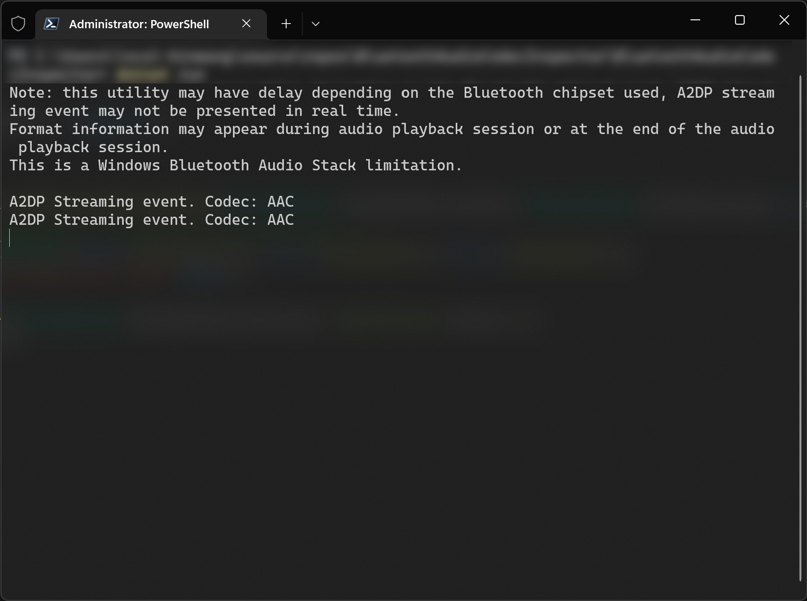

# Windows Bluetooth A2DP Codec Inspector

This utility helps you inspect Windows Bluetooth A2DP Codec without installing the full Windows Performance Analyzer thing (or use xperf CLI or whatever.)

The usage should be self-explanatory.

# Build

Standard .NET 6 SDK is required. Then just run `dotnet build -c Release`.

# License

MIT License

# Acknowledgements

- [How to Check Which Bluetooth A2DP Audio Codec Is Used on Windows](https://helgeklein.com/blog/how-to-check-which-bluetooth-a2dp-audio-codec-is-used-on-windows/)
